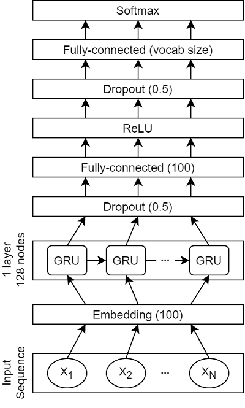
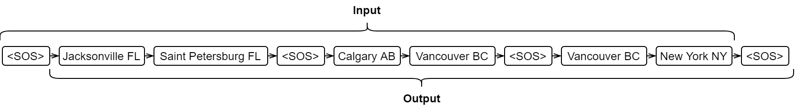

# Q2-3-4) Predicting Next Cities

2. Given a sequence of searched cities, find the most likely city or cities to be also searched next, within the same session. Your code should include a function that takes a list of 0 to n cities and returns the most likely next city or cities. Keep in mind that the goal is to call this function each time a user performs a search. It should therefore be fast to execute.

3. There are few features describing each user: user id, joining date and country. Are these features useful to predict the most likely city to be searched? How do they compare to the other features tried in Question 2 (i.e. previous cities searched)? Can the algorithm implemented in Question 2 be improved by making use of these features?

4. How did you measure the performance of the prediction algorithms from questions 2 and 3? What is your confidence that the measured score is accurate?

## Solution

### Overall Methodology

The model utilized to address this task is a Gated Recurrent Unit (GRU). The architecture of the model is given below.

The model was compared with two baseline models:

1. A unigram model, which selects the most popular label, having filtered out the labels that were already seen within the session.
2. A bigram model, which uses the transition probability matrix to select the most probable label after filtering the already seen labels within the session.

We assume that the previous search sessions for a user (if available) can be informative in the prediction of the potential next city/cities. As a result, when preparing the dataset, we made a user-based collection, in which the input samples are the whole history of a user, having each two consecutive sessions separated with an identifier, called _SOS_ (Separator Of Sessions), which is also the first and the last element within each user sequence.

We also followed the assumption that a successful prediction of a sequence is dependent on successful prediction of the immediate next element, as we know that an error from one prediction can propagate to the next ones. As a result, when training and testing the model, we focused on the performance of the prediction for the next city. The figure below shows a sample input and output for a given user, whose history is composed of three different sessions. As an example, at the first time-step, only _SOS_ is fed to the model and the goal is to predict _Jacksonville FL_ . At the next step, _Jacksonville FL_ is the input to the model, and _Saint Petersburg FL_ is the expected output. This process continues until the model reaches _New York NY_ which is the last city in the last session, where it should predict _SOS_ .

### Evaluation Metrics

To evaluate the models, various metrics have been used to capture different aspects of a model. These metrics can be divided between classification metrics and information retrieval metrics.

As the classification metrics, we used accuracy, macro-F1 score, and weighted F1 score. While accuracy considers the overlap between predictions and the actual labels, it does not take into account the distribution of labels over the data. This can result in a naive approach having a high accuracy, if the data is too unbalanced (which is the case at hand).

As the retrieval metrics, we used the following: 1) Average Rank; 2) Hit@k; 3) MRR@k; and 4) Percentile@k.

The average rank calculates the average position of the correct answer within a ranked list of potential answers. The Hit@k metrics calculates the number of samples for which a correct answer was found in the top-k prediction list. MRR@k (Mean Reciprocal Rank) is an extended versions of Hit@k, which also takes into account the rank of the correct answer within the top-k prediction list. While MRR@k is a common metric in information retrieval, one of its drawbacks is that it heavily penalizes correct predictions that are not ranked first. This led us to come up with a modified version of MRR@k, which we named Percentile@k, that returns the average percentile of the correct answer within the ranked prediction list.

Since the number of _SOS_ markers is very high, when using the retrieval-based metrics, we evaluated the model only for instances whose correct label was not _SOS_ , and masked the _SOS_ likelihood from the model prediction in order to stop the models from predicting the session separators. Because of this, we also introduced accuracy, precision, recall, and F1, only for the _SOS_ label.

### Results

__Overall Results for all three models__

|           | Accuracy | Macro-F1 | Weighted-F1 | Average Rank | Hit@5 | MRR@5 |
|:----------|:--------:|:--------:|:-----------:|:------------:|:-----:|:-----:|
|__GRU__    |  38.58   |  11.85   |    30.43    |     3.47     | 62.99 | 36.76 |
|__Unigram__|  45.12   |   1.27   |    31.37    |     7.31     | 47.27 | 27.48 |
|__Bigram__ |  45.12   |   1.26   |    31.37    |     3.42     | 63.37 | 37.29 |

__Performance on SOS__

|              | Accuracy |   F1  | Precision | Recall |
|:-------------|:--------:|:-----:|:---------:|:------:|
|__GRU__       |  73.19   | 68.02 |   61.52   | 76.06  |
|__Unigram__   |  74.99   | 74.99 |   59.99   | 100.00 |
|__Bigram__    |  75.00   | 75.00 |   60.00   | 100.00 |

__Hit@k__

|           | k = 1 | k = 2 | k = 3 | k = 4 | k = 5 | k = 6 | k = 7 | k = 8 | k = 9 | k = 10 |
|:----------|:-----:|:-----:|:-----:|:-----:|:-----:|:-----:|:-----:|:-----:|:-----:|:------:|
|__GRU__    | 22.65 | 36.59 | 47.41 | 55.83 | 62.99 | 67.80 | 72.39 | 76.15 | 80.48 | 84.08  |
|__Unigram__| 17.05 | 26.92 | 35.05 | 41.93 | 47.27 | 51.36 | 56.07 | 58.86 | 60.80 | 63.07  |
|__Bigram__ | 23.14 | 37.20 | 48.02 | 56.90 | 63.37 | 68.99 | 73.56 | 77.55 | 81.51 | 84.83  |

__MRR@k__

|           | k = 1 | k = 2 | k = 3 | k = 4 | k = 5 | k = 6 | k = 7 | k = 8 | k = 9 | k = 10 |
|:----------|:-----:|:-----:|:-----:|:-----:|:-----:|:-----:|:-----:|:-----:|:-----:|:------:|
|__GRU__    | 22.65 | 29.62 | 33.22 | 35.33 | 36.76 | 37.56 | 38.22 | 38.69 | 39.17 | 39.53  |
|__Unigram__| 17.05 | 21.98 | 24.69 | 26.41 | 27.48 | 28.16 | 28.84 | 29.19 | 29.40 | 29.63  |
|__Bigram__ | 23.14 | 30.17 | 33.78 | 36.00 | 37.29 | 38.23 | 38.88 | 39.38 | 39.82 | 40.15  |

__Percentile@k__

|           | k = 1 | k = 2 | k = 3 | k = 4 | k = 5 | k = 6 | k = 7 | k = 8 | k = 9 | k = 10 |
|:----------|:-----:|:-----:|:-----:|:-----:|:-----:|:-----:|:-----:|:-----:|:-----:|:------:|
|__GRU__    | 22.65 | 29.62 | 35.55 | 40.62 | 45.09 | 48.88 | 52.24 | 55.23 | 58.03 | 60.64  |
|__Unigram__| 17.05 | 21.98 | 26.34 | 30.24 | 33.64 | 36.60 | 39.38 | 41.81 | 43.92 | 45.84  |
|__Bigram__ | 23.14 | 30.17 | 36.12 | 41.32 | 45.73 | 49.60 | 53.03 | 56.09 | 58.92 | 61.51  |

### Discussion

Looking at the tables, we can observe that the GRU model has achieved better results in almost every metric than the unigram model. The reason that it did not outperform the unigram in the accuracy and weighted F1 is due to the high number of session separator markers in the data, and the fact that the unigram model has a very high tendency in predicting these separators.

For the bigram model, we can observe that it has marginally outperformed the GRU model in almost every measure, except the macro-F1 score. The reason again lies in the imbalanced distribution of samples, with the first 10 cities making up more than 50% of the data population (when _SOS_ is excluded). However, when inspecting the output predictions generated by the bigram model, we can observe that when the _SOS_ is not excluded, it has only predicted _SOS_ and _New York_ for all test samples, while the GRU model has predicted 55 distinct labels. We believe that if the final system is going to be deployed in a scenario, where the goal is to make a sequence prediction on the next cities within a session, the GRU has a better capability, as it does not limit its prediction to only 1 city due to not predicting the _SOS_ marker too early in the sequence. In the other scenario, where the goal is to only predict the next city, and excluding the _SOS_ marker, although the bigram model would yield a higher performance, we believe that it has less capability in order to make a personalized recommendation than the GRU model.

The bias in the unigram and bigram models can also be seen in the _SOS_ performance table. We can see that these two models have achieved a recall score of 100% on the prediction of _SOS_ , which shows the high tendency in these models in predicting this label.

It is worth mentioning that, the GRU model was trained with the goal of maximizing the marco-F1 score, based on the assumption that the final goal of the model is to be deployed in a sequence prediction scenario. To that end, weighted loss with class-weights proportional to the invserse of the number of each label was used. It is possible to deactivate the class-weights and modify the objective function in order to maximize the measures other than macro-F1 score, and outperform the bigram model in other measures. It has been experimented with, and although the GRU model achieves better performance than both baselines, a limited set of labels are predicted.

### Additional Experiments

In order to analyze the effect of the user history of previous sessions, we also experimented with a version of the model in which the dataset is created in a session-based fashion, thus for each session we ignore the previous user sessions. We observed that in this scenario, the performance of the model was inferior. Therefore, it is useful and highly recommended to make use of the user ID feature in creating a user history.

As in the final version of the model, the samples were created in the form of a history, the time-stamps were already incorporated in the model to determine the order of the sessions for each user. The only feature that is not explicitly encoded in the model is the country. To that end, we experimented with the addition of a small embedding layer dedicated to modeling the users' countries. The output of this embedding layer was concatenated with the output of the hidden layer, before being fed to the final fully-connected layers. Based on our experiments, this addition did not result in a better performance. This is in line with the observations from question 1, as we saw that the distribution of the searched cities for different countries followed a similar pattern. Knowing that the neural networks are mainly capable of only handling correlation (which is a two-sided relation), the lack of improvement after adding the country can also support our hypothesis in question 1 that the searched cities are not informative of the countries, and vice versa.

### Future Work

Observing that the session separators makes up a significant part of the data, we can develop a cascaded model, where first the model decides if the next label is _SOS_ or not, and if negative, decides between the available cities. This way, it is more convenient to handle the class-weights in order to achieve a better performance.

Secondly, the previous sessions of a user can be encoded in a hierarchical fashion (with/without an attention mechanism). In another word, we can first have an encoder to extract a representation for the sessions, and the second encoder extracts a representation for the history based on the representation of the previous sessions.

## Instructions on Running the Code

The main files are the following:

1. __Q2_Baseline.ipynb__ , which is the file that runs the unigram and bigram baseline models.

2. __Q2_Main.ipynb__ , that is the file that includes the code for training the GRU model for 100 epochs, retrieving the optimal model from the epoch in which the marco-F1 score was maximized on the development data, and testing the chosen model on the test set. The configuration for the training can be set using the _config.yml_ file.

3. __Q2_TestOnly.ipynb__ can be used to load an already saved model (i.e. the optimal GRU model that we discussed above), and testing it on the test dataset. In order to decide whether to run the model on GPU or CPU, only the _gpu_ line in the _config.yml_ file should be modified.